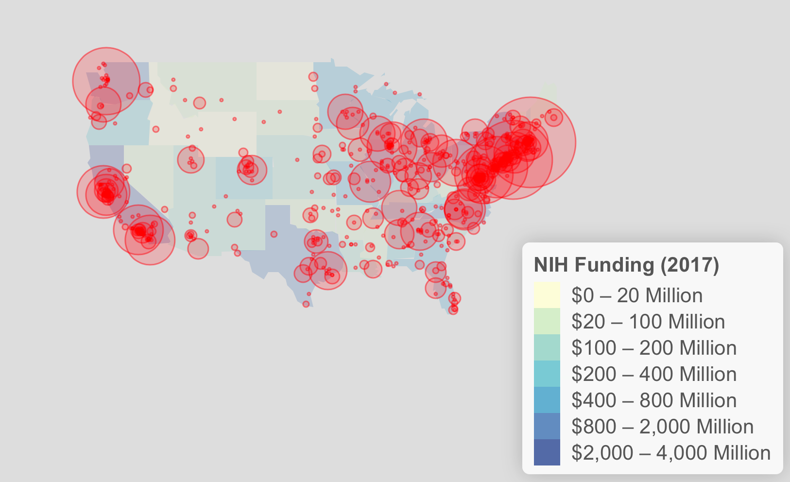
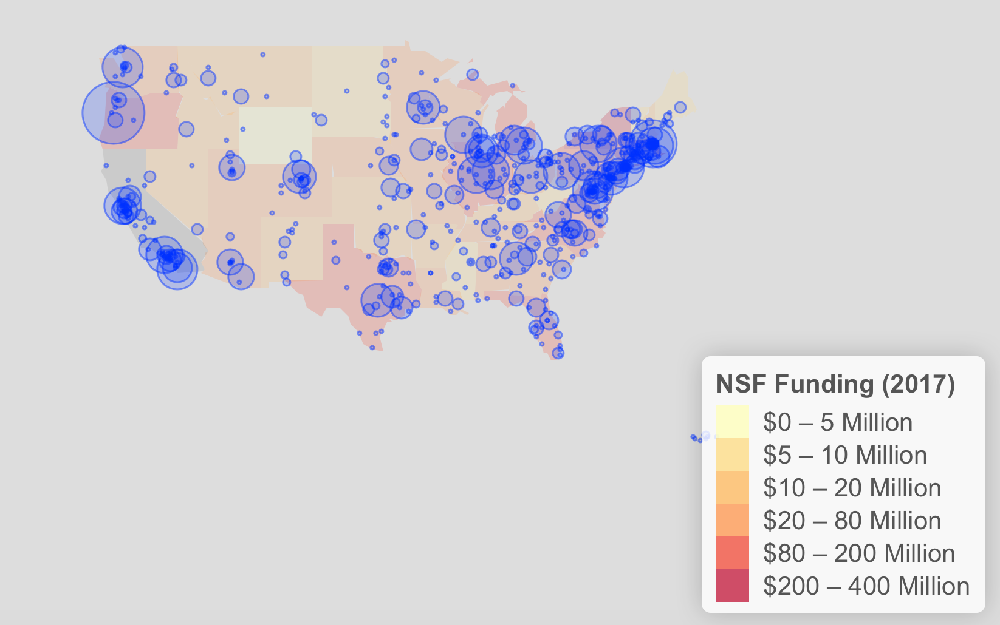

# Grants
NSF and NIH grants analysis in 2017

[click here to check the grant analysis report](https://xiangmei21.github.io/Grants/)

NSF and NIH are two of the largest public funders that provide awards for research and education in biomedical health, science and engineering. The US government gives billions in science grants each year through NSF and NIH. NSF accounts for about 20 percent of federal support to academic institutions for basic research. And The NIH invests nearly $32.3 billion in fiscal year 2016 in medical research for the American people. In this project, I analyzed NSF and NIH grants in 2017 and investigated the patterns of grants by state, institution, research field to track the results of grants.

#### Mapping Grants Amount by States/City
Because NIH and NSF grants data does not include map location information (except state and city name of institutions), my first step is to find latitude and longitude of institution city in NIH and NSF grants data by merging with map data. I summarized the funding sum by state and city and mapped them on US map. Explore and try click the city circles to find funding amount below.

